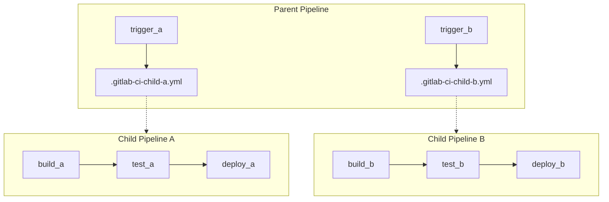

Parent-child pipelines are an advanced CI/CD concept that extends the capabilities of CI pipelines by allowing you to create complex workflows, dependencies, and coordination between multiple pipelines. This approach is particularly useful for large, distributed projects or microservices architectures where you need to manage separate codebases and deployments.

Here's an overview of parent-child pipelines:

1. **Parent Pipeline**:
   - The parent pipeline is the main pipeline that typically manages high-level tasks or orchestration for the entire project.
   - It may include tasks like triggering child pipelines, coordinating deployments across multiple services or repositories, or running integration tests that involve multiple components.
   - The parent pipeline can be triggered manually, on a schedule, or in response to specific events (e.g., code commits or external triggers).

2. **Child Pipelines**:
   - Child pipelines are separate CI/CD pipelines that are defined and maintained within individual code repositories or projects.
   - Each child pipeline handles a specific aspect of the project, such as building a microservice, running tests for a library, or deploying a component.
   - Child pipelines are triggered by the parent pipeline or can run independently as standalone pipelines.
   - They can have their own set of stages and jobs tailored to the specific needs of the component or repository they belong to.

3. **Inter-Pipeline Communication**:
   - Parent-child pipelines can communicate with each other through variables, artifacts, or external data sources.
   - Information can be passed from the parent pipeline to child pipelines, and vice versa, to coordinate activities or share data.

4. **Dependency Management**:
   - Parent-child pipelines allow you to define dependencies between pipelines. Child pipelines can depend on the successful completion of other child pipelines or specific stages within those pipelines.
   - Dependencies ensure that tasks are executed in the correct order and that downstream tasks wait for upstream tasks to complete successfully.

5. **Scalability and Modularity**:
   - This approach promotes modularity in your CI/CD setup. Each component or repository can have its own CI/CD configuration, making it easier to manage and scale as your project grows.
   - Scalability is achieved by independently scaling child pipelines to handle increased load or parallel processing.

Use cases for parent-child pipelines include:

- **Microservices Architectures**: When you have multiple microservices or components that need separate CI/CD pipelines but also need coordination for integration or deployment.

- **Complex Projects**: In large and complex projects where individual teams manage their codebases but need a central way to orchestrate releases or integration tests.

- **Parallel Execution**: For scenarios where you want to run multiple independent tasks or jobs in parallel, such as building, testing, or deploying different components simultaneously.

- **Code Reusability**: To promote code reusability and maintainability by separating CI/CD configurations into smaller, focused pipelines.

Implementing parent-child pipelines typically requires a CI/CD platform that supports this concept, and you'll need to define the relationships and triggers between pipelines in your configuration files or through the CI/CD platform's interface. GitLab CI, for example, provides support for parent-child pipelines through its `extends` keyword and allows you to create complex workflows across repositories.
